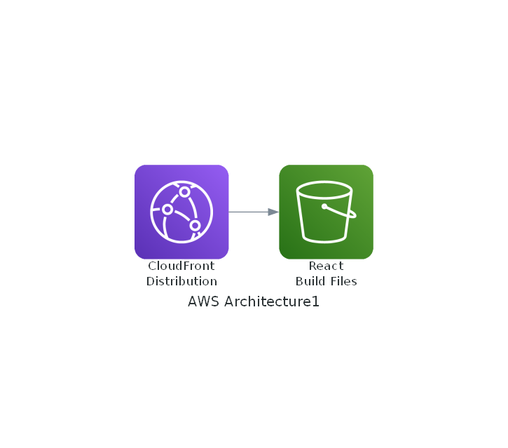

# CDK Sample Project

このプロジェクトは、ClineがAWS CDKを使用してReactアプリケーションを静的ウェブサイトとしてホスティングするインフラストラクチャを構築するサンプルです。

## アーキテクチャ概要



主要なコンポーネント：

- **S3バケット**: Reactアプリケーションの静的ファイルを保存
- **CloudFront**: コンテンツのグローバル配信とHTTPS対応
- **Origin Access Identity (OAI)**: S3バケットへのセキュアなアクセス制御

## 機能

- S3バケットへの直接アクセスをブロックし、CloudFrontを経由したアクセスのみを許可
- HTTPSリダイレクトの自動設定
- SPAのルーティングに対応（404エラーを/index.htmlにリダイレクト）
- CloudFrontのキャッシュ制御

## 前提条件

- Node.js 14.x以上
- AWS CLIのインストールと設定
- AWS CDK CLI (`npm install -g aws-cdk`)

## セットアップ手順

1. 依存関係のインストール
```bash
npm install
```

2. AWSクレデンシャルの設定
```bash
aws configure
```

3. CDKの初期化（初回のみ）
```bash
cdk bootstrap
```

4. インフラのデプロイ
```bash
cdk deploy
```

## 設計上の注意点

- 開発環境向けの設定として、S3バケットには`RemovalPolicy.DESTROY`と`autoDeleteObjects: true`が設定されています
- 本番環境では、これらの設定を適切に変更することを推奨します

## 出力

デプロイ完了時に、CloudFrontのドメイン名が出力されます。このドメインを使用してWebサイトにアクセスできます。

## クリーンアップ

環境を削除する場合は以下のコマンドを実行：

```bash
cdk destroy
```

## ライセンス

このプロジェクトはMITライセンスの下で公開されています。
