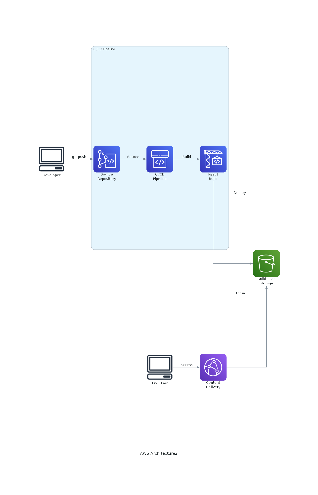

# React アプリケーション デプロイメントインフラストラクチャ

このプロジェクトは、ReactアプリケーションのためのAWSインフラストラクチャをAWS CDKを使用して構築します。

## アーキテクチャ概要



## 主な構成要素

### フロントエンド配信基盤
- **Amazon S3**: Reactアプリケーションのホスティング
- **Amazon CloudFront**: グローバルなコンテンツ配信とHTTPS対応
  - カスタムエラーページ設定によるSPA対応（404→index.html）
  - HTTPS通信の強制

### CI/CD パイプライン
- **AWS CodeCommit**: ソースコード管理
- **AWS CodeBuild**: Reactアプリケーションのビルド
  - Node.js環境（AWS Linux 2 Standard 7.0）
  - `npm install` および `npm run build` の実行
- **AWS CodePipeline**: デプロイメントの自動化
  1. Source Stage: CodeCommitからのソース取得
  2. Build Stage: CodeBuildによるアプリケーションビルド
  3. Deploy Stage: S3へのデプロイとCloudFrontのキャッシュ無効化

## デプロイメント手順

1. CDKプロジェクトのデプロイ:
```bash
npm install
cdk deploy
```

2. デプロイ後、以下の情報が出力されます：
- CloudFrontディストリビューションのドメイン名
- CodeCommitリポジトリのクローンURL

3. CodeCommitリポジトリにReactアプリケーションをプッシュすることで、自動的にビルドとデプロイが開始されます

## 開発環境の注意点

- S3バケットは `RemovalPolicy.DESTROY` が設定されており、スタックの削除時にコンテンツも一緒に削除されます
- 本番環境では、データ保護のためにこの設定を見直すことを推奨します

## 前提条件

- Node.js 18.x 以上
- AWS CDK CLI
- AWS認証情報の設定
