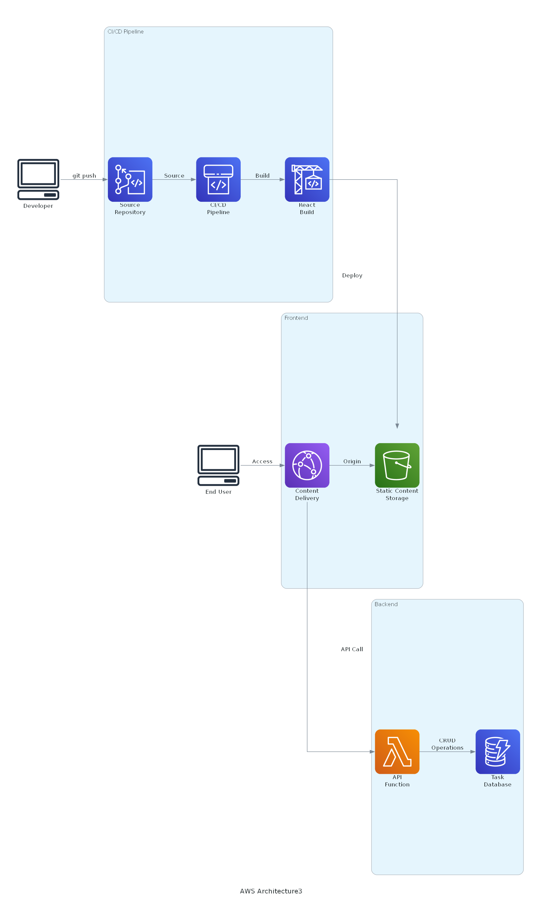

# Serverless Task Management Application

このプロジェクトは、AWS CDKを使用して構築されたサーバーレスタスク管理アプリケーションです。フロントエンドはReact、バックエンドはAWS Lambda + DynamoDBを使用し、完全なCI/CDパイプラインを備えています。

## アーキテクチャ



### 主要コンポーネント

#### フロントエンド
- **S3**: 静的ウェブサイトホスティング
- **CloudFront**: コンテンツ配信とHTTPS対応
- **React**: シングルページアプリケーション（SPA）

#### バックエンド
- **Lambda**: サーバーレスAPI実装
  - Node.js 18.x ランタイム
  - タスクのCRUD操作をサポート
- **DynamoDB**: NoSQLデータベース
  - オンデマンドキャパシティモード
  - タスク情報の永続化

#### CI/CD パイプライン
- **CodeCommit**: ソースコード管理
- **CodeBuild**: ビルドプロセス自動化
- **CodePipeline**: デプロイメント自動化

## デプロイ手順

1. 前提条件
   ```bash
   npm install -g aws-cdk
   ```

2. プロジェクトのセットアップ
   ```bash
   npm install
   ```

3. CDKデプロイ
   ```bash
   cdk deploy
   ```

デプロイ完了後、以下の情報が出力されます：
- CloudFront ディストリビューションのドメイン名
- CodeCommitリポジトリのクローンURL
- DynamoDBテーブル名
- Lambda関数名

## 開発ワークフロー

1. CodeCommitリポジトリをクローン
2. Reactアプリケーションの開発
3. 変更をメインブランチにプッシュ
4. 自動的にビルドとデプロイが実行

## APIエンドポイント

- `GET /api/tasks`: タスク一覧の取得
- `GET /api/tasks/{id}`: 特定のタスクの取得
- `POST /api/tasks`: 新規タスクの作成
- `PUT /api/tasks/{id}`: タスクの更新
- `DELETE /api/tasks/{id}`: タスクの削除

## セキュリティ仕様

- CloudFrontによるHTTPSの強制
- S3バケットへの直接アクセスをブロック
- IAMロールによる最小権限の原則
- APIリクエストのCloudFrontプロキシ化

## 注意事項

このプロジェクトは開発環境向けに設定されています：
- DynamoDBテーブルの削除保護が無効
- S3バケットの削除保護が無効

本番環境へのデプロイ時は、これらの保護設定を有効にすることを推奨します。
